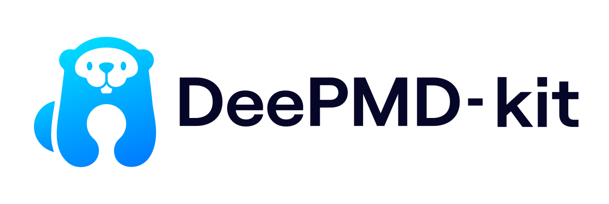

[<picture><source media="(prefers-color-scheme: dark)" srcset="./doc/_static/logo-dark.svg"><source media="(prefers-color-scheme: light)" srcset="./doc/_static/logo.svg"></picture>](./doc/logo.md)

--------------------------------------------------------------------------------

DeePMD-kit Manual
========

# Table of contents
- [About DeePMD-kit](#about-deepmd-kit)
 	- [Highlighted features](#highlighted-features)
 	- [License and credits](#license-and-credits)
- [Download and install](#download-and-install)
- [Use DeePMD-kit](#use-deepmd-kit)
- [Code structure](#code-structure)
- [Troubleshooting](#troubleshooting)

# About DeePMD-kit
DeePMD-kit is a package written in Python/C++, designed to minimize the effort required to build deep learning-based model of interatomic potential energy and force field and to perform molecular dynamics (MD). This brings new hopes to addressing the accuracy-versus-efficiency dilemma in molecular simulations. Applications of DeePMD-kit span from finite molecules to extended systems and from metallic systems to chemically bonded systems.

For more information, check the [documentation](https://deepmd.readthedocs.io/).

## Highlighted features
* **interfaced with TensorFlow**, one of the most popular deep learning frameworks, making the training process highly automatic and efficient, in addition, Tensorboard can be used to visualize training procedures.
* **interfaced with high-performance classical MD packages**, i.e., LAMMPS.
* **implements the Deep Potential series models**, which have been successfully applied to finite and extended systems including organic molecules, metals, semiconductors, insulators, etc.
* **implements MPI and GPU supports**, making it highly efficient for high-performance parallel and distributed computing.
* **highly modularized**, easy to adapt to different descriptors for deep learning-based potential energy models.

## License and credits
The project DeePMD-kit is licensed under [GNU LGPLv3.0](./LICENSE).
If you use this code in any future publications, please cite the following publications for general purpose:
Breaking the Speed, Power, Cost and Size Limits of Molecular Dynamics with Ab Initio Accuracy # NATCOMPUTSCI-23-0729

In addition, please follow [the bib file](CITATIONS.bib) to cite the methods you used.

# Download and install

Please follow our [GitHub](https://github.com/deepmodeling/deepmd-kit) webpage to download the [latest released version](https://github.com/deepmodeling/deepmd-kit/tree/master) and [development version](https://github.com/deepmodeling/deepmd-kit/tree/devel).

DeePMD-kit offers multiple installation methods. It is recommended to use easy methods like [offline packages](doc/install/easy-install.md#offline-packages), [conda](doc/install/easy-install.md#with-conda) and [docker](doc/install/easy-install.md#with-docker).

One may manually install DeePMD-kit by following the instructions on [installing the Python interface](doc/install/install-from-source.md#install-the-python-interface) and [installing the C++ interface](doc/install/install-from-source.md#install-the-c-interface). The C++ interface is necessary when using DeePMD-kit with LAMMPS.

# Use DeePMD-kit

A quick start on using DeePMD-kit can be found [here](doc/getting-started/quick_start.ipynb).

A full [document](doc/train/train-input-auto.rst) on options in the training input script is available.

# Advanced

- [Installation](doc/install/index.md)
    - [Install from source code](doc/install/install-from-source.md)
    - [Install from pre-compiled C library](doc/install/install-from-c-library.md)
- [Data](doc/data/index.md)
    - [System](doc/data/system.md)
    - [Formats of a system](doc/data/data-conv.md)
    - [Prepare data with dpdata](doc/data/dpdata.md)
- [Model](doc/model/index.md)
    - [Overall](doc/model/overall.md)
    - [Descriptor `"se_e2_a"`](doc/model/train-se-e2-a.md)
    - [Descriptor `"se_atten"`](doc/model/train-se-atten.md)
    - [Descriptor `sel`](doc/model/sel.md)
    - [Fit energy](doc/model/train-energy.md)
    - [Train a Deep Potential model using `type embedding` approach](doc/model/train-se-e2-a-tebd.md)
- [Training](doc/train/index.md)
    - [Training a model](doc/train/training.md)
    - [Advanced options](doc/train/training-advanced.md)
    - [Parallel training](doc/train/parallel-training.md)
    - [TensorBoard Usage](doc/train/tensorboard.md)
    - [Known limitations of using GPUs](doc/train/gpu-limitations.md)
    - [Training Parameters](doc/train-input-auto.rst)
- [Freeze and Compress](doc/freeze/index.rst)
    - [Freeze a model](doc/freeze/freeze.md)
    - [Compress a model](doc/freeze/compress.md)
- [Test](doc/test/index.rst)
    - [Test a model](doc/test/test.md)
    - [Calculate Model Deviation](doc/test/model-deviation.md)
- [Inference](doc/inference/index.rst)
    - [Python interface](doc/inference/python.md)
    - [C++ interface](doc/inference/cxx.md)
- [Integrate with third-party packages](doc/third-party/index.rst)
    - [Run MD with LAMMPS](doc/third-party/lammps.md)
    - [LAMMPS commands](doc/third-party/lammps-command.md)
    - [Interfaces out of DeePMD-kit](doc/third-party/out-of-deepmd-kit.md)
- [Use MDPU](doc/mdpu/index.md)

# Code structure

The code is organized as follows:

* `data/raw`: tools manipulating the raw data files.
* `examples`: examples.
* `deepmd`: DeePMD-kit python modules.
* `source/api_cc`: source code of DeePMD-kit C++ API.
* `source/lib`: source code of DeePMD-kit library.
* `source/lmp`: source code of Lammps module.
* `source/op`: TensorFlow op implementation. working with the library.

# Contributing

See [DeePMD-kit Contributing Guide](CONTRIBUTING.md) to become a contributor! 🤓
